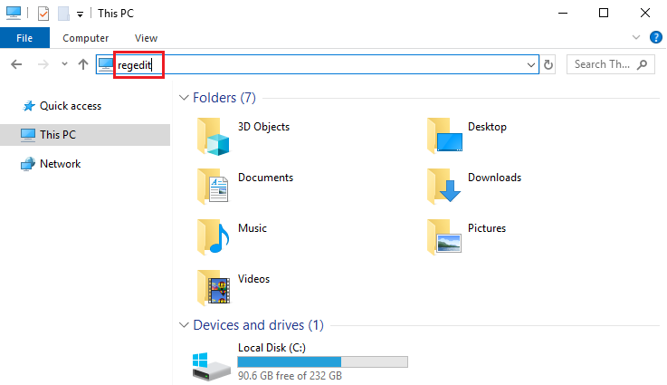
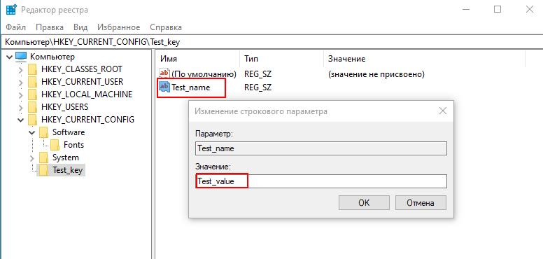

Как пользоваться редактором реестра Windows.
Что делать, если ничего не получается
=============
**Содержание**

1. [Что такое редактор реестра Windows?](#что-такое-редактор-реестра-windows)
2. [Как открыть редактор реестра?](#как-открыть-редактор-реестра)
- [Способ 1. Через окно «Выполнить»](#способ-1-через-окно-выполнить)
- [Способ 2. Через поле поиска](#способ-2-через-поле-поиска)
- [Способ 3. Через проводник Windows](#способ-3-через-проводник-windows)
3. [Основные операции](#основные-операции)
- [Создание раздела реестра](#создание-раздела-реестра)
- [Изменение параметров реестра](#изменение-параметров-реестра)
- [Экспорт раздела реестра](#экспорт-раздела-реестра)
- [Импорт раздела реестра](#импорт-раздела-реестра)
4. [Часто возникающие ошибки и способы их устранения](#часто-возникающие-ошибки-и-способы-их-устранения)

 
## Что такое редактор реестра Windows?

Реестр Windows — это база данных, в которой хранятся различные параметры операционной системы, недоступные через обычное меню настроек. В частности, через реестр можно задать настройки автозагрузки и контекстного меню, редактировать параметры операционной системы и многое другое. Для простоты навигации данные в реестре хранятся в виде древовидной структуры. Подобно файловой системе Windows, в структуре реестра есть разделы (также известные как ключи), похожие на папки, внутри них есть подразделы, напоминающие подпапки. Описание основных разделов представлено в Таблице 1.
Главным инструментом для просмотра, поиска, редактирования и резервного копирования записей реестра служит встроенная в Windows утилита Regedit. 
 
 **Таблица 1. Описание основных разделов системного реестра**

 
|**Раздел реестра** |**Назначение**|
|-----------|-----------|
|HKEY_CLASSES_ROOT|Содержит информацию обо всех типах файлов, зарегистрированных в Windows. Система использует эти соответствия, чтобы определить, какие приложения или компоненты нужно использовать при открытии или создании тех или иных типов файлов или объектов данных.|
|HKEY_LOCAL_MACHINE|В данном разделе хранится информация о глобальных настройках системы, применимых ко всем пользователям.|
|HKEY_USERS|Данный раздел содержит информацию о настройках профилей всех пользователей компьютера, а также настройки по умолчанию.|
|HKEY_CURRENT_CONFIG|Содержит сведения о настройке оборудования для текущего сеанса.|

## Как открыть редактор реестра?
> Предупреждение. Некорректное изменение информации, сохранённой в системном реестре, может привести к сбою в работе компьютера. Перед внесением каких-либо изменений рекомендуется создать точку восстановления реестра. 
Это позволит вернуться к значениям настроек последней сохраненной контрольной точки в случае ошибок при работе с реестром.

Для запуска редактора реестра воспользуйтесь одним из приведённых ниже способов:

### Способ 1. Через окно «Выполнить»

Откройте окно выполнения команд с помощью комбинации горячих клавиш `Win+R`.
В левом углу отобразится окно **Выполнить**. Введите `regedit` в поле **Открыть** и нажмите **ОК**.
 

### Способ 2. Через поле поиска

Нажмите на значок поиска возле меню ПУСК и введите `regedit` в поисковой строке. В результатах поисковой выдачи появится ярлык для запуска редактора.

 

### Способ 3. Через проводник Windows

Запустите проводник (клавиши `Win+E`) и введите `regedit` в поисковой строке.

 

## Основные операции

Интерфейс редактора реестра разделён на две части. В левой части основного окна отображается список корневых разделов реестра, в правой — содержимое текущего раздела. 

 
 
Через редактор реестра доступны следующие операции: создание/удаление раздела, изменение параметров реестра, импорт/экспорт разделов реестра и другие. Ниже приведены примеры выполнения основных операций.

### Создание раздела реестра

1.	В левой части окна щёлкните правой кнопкой мыши на раздел, внутри которого Вы хотите создать подраздел, и в контекстном меню выберите **Создать → Раздел**.

  
 
2.	Задайте имя нового раздела. Теперь в нём можно создать параметр и присвоить ему значение. Щелкните правой кнопкой мыши в правой части раздела и нажмите **Создать**, после чего выберите необходимый тип параметра, например, **Строковый параметр**.

 

3.	Введите наименование параметра и присвойте ему значение в соответствующей строке, затем нажмите **ОК**, чтобы сохранить значение.

  

### Изменение параметров реестра

Для изменения параметров раздела щёлкните по нему правой кнопкой мыши и нажмите **Изменить**. Введите новое значение параметра и нажмите **ОК**, чтобы сохранить изменения.

 
 
### Экспорт раздела реестра

1.	Нажмите правой кнопкой мыши на раздел реестра, который необходимо экспортировать, затем выберите **Экспортировать**.

  
 
2.	Выберите папку назначения, укажите имя файла и нажмите на кнопку **Сохранить**. Элемент сохранится с расширением reg.

   

### Импорт раздела реестра

1.	В левом верхнем углу выберите **Файл → Импорт**.

   
  
2.	Выберите нужный файл и нажмите **Открыть** для импорта раздела в реестр.

  

3.	После импорта отобразится информационное сообщение с результатом операции.

 
 
## Часто возникающие ошибки и способы их устранения

1.	Ошибка при создании раздела

 
 
**Проблема**: не удается создать раздел в реестре.

**Причина**: у текущего пользователя отсутствуют права на создание нового раздела реестра.

**Решение**: запустите редактор реестра от имени администратора или обратитесь к системному администратору для получения необходимых разрешений.
Для запуска редактора реестра от имени администратора введите `regedit` в поле поиска Windows 
и выберите пункт **Запуск от имени администратора**.

 
 
