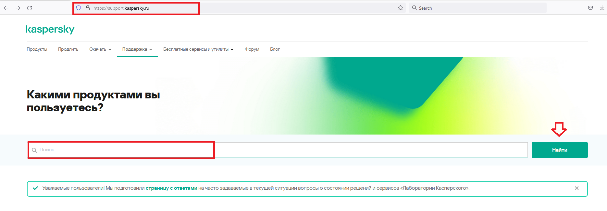
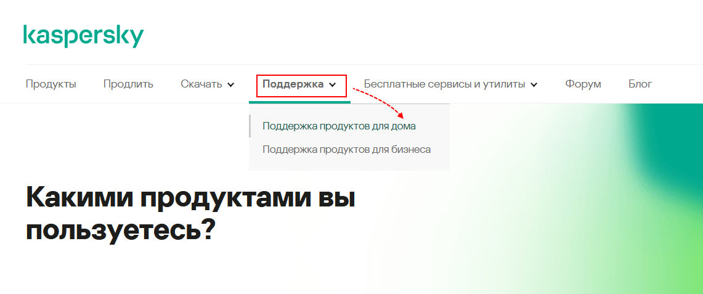
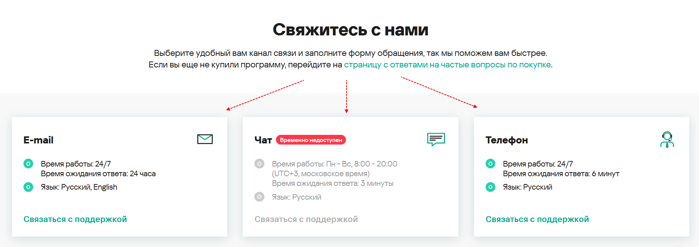
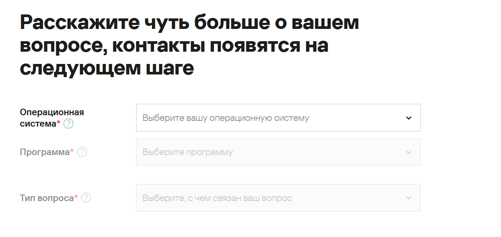
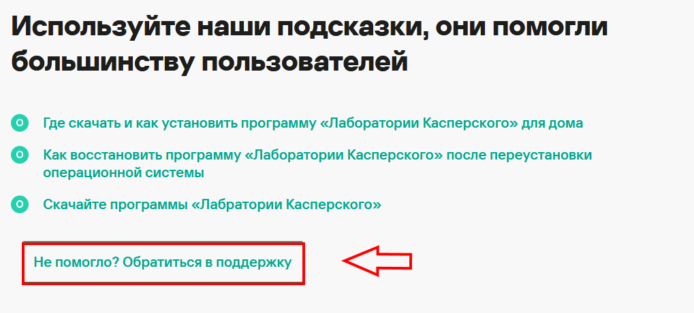
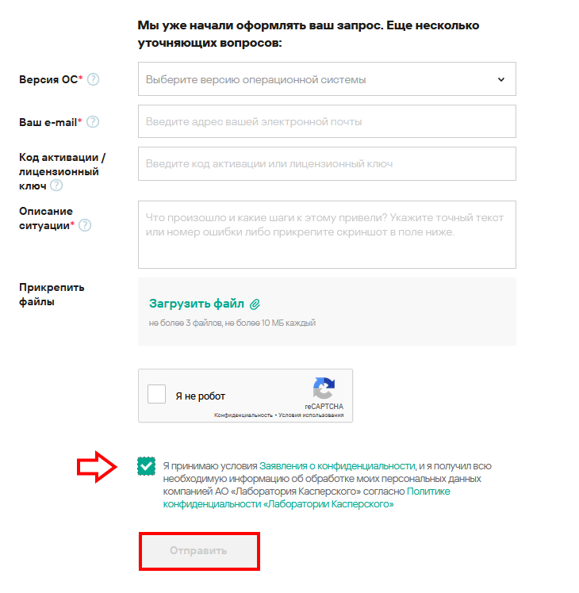
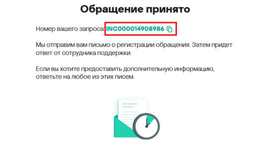

Как связаться с инженерами поддержки «Лаборатории Касперского»
=============

Многие проблемы, которые могут возникнуть в процессе использования продуктов «Лаборатории Касперского», можно решить самостоятельно, следуя инструкциям на сайте https://support.kaspersky.ru. В них подробно описано, как оперативно решить различные проблемы. Чтобы просмотреть инструкции, перейдите на [страницу с ответами](https://support.kaspersky.ru/faq/2022hotline). Также можно воспользоваться строкой поиска, как показано на рисунке ниже. 
  
Если проблемы не удаётся решить самостоятельно обратитесь к инженерам поддержки «Лаборатории Касперского».
1.	На панели сверху выберите **Поддержка → Поддержка продуктов** для дома, чтобы перейти на страницу поддержки продуктов для дома и мобильных устройств.
 
2.	Перейдите в нижнюю часть страницы и выберите удобный способ связи.

3.	Нажмите **Связаться с поддержкой**. В появившемся окне заполните форму, выбрав необходимые пункты из выпадающего меню.   

4.	После заполнения формы будут предложены подсказки. Если у Вас остались вопросы, нажмите **Обратиться в поддержку**. 

5.	Ответьте на вопросы и укажите контактную информацию. Также можно прикрепить файлы, которые могут помочь в решении проблемы. Поставьте галочку напротив блока «Я принимаю условия Заявления о конфиденциальности» и нажмите **Отправить**. 
 
6.	Запрос будет отправлен в службу поддержки «Лаборатории Касперского» и ему будет присвоен номер. Дождитесь ответа на Ваше обращение.

 
 
